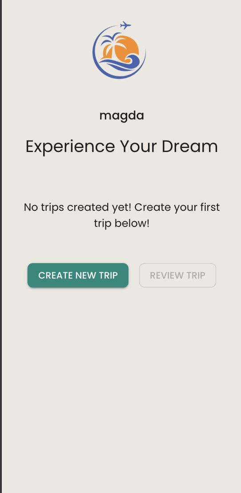
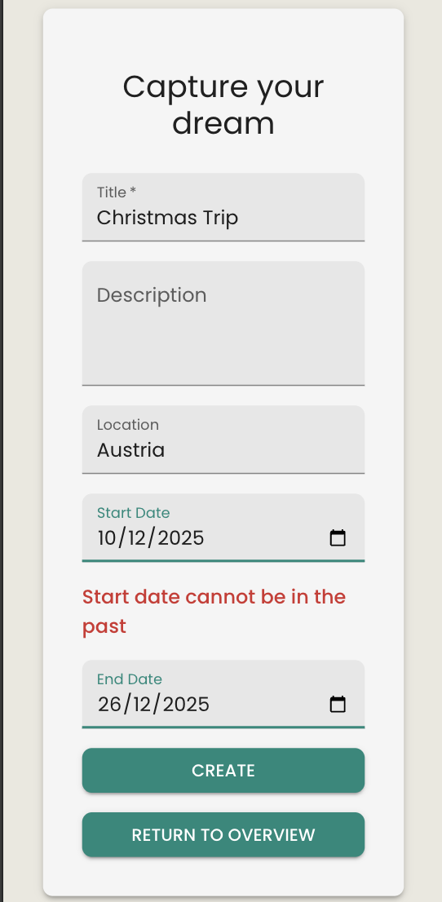
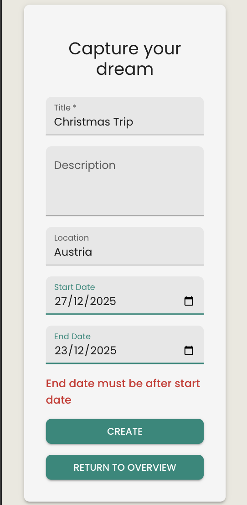

# Travel Agent App 

Description

A full stack single-page application that allows users to plan their dream trips and add activities to each one. If users need inspiration, they can utilise the built-in AI assistant to generate a personalised list of activity ideas. 

This is my third project in my three-month intensive bootcamp at General Assembly.

*This app has two repositories: frontend and backend

Code snippets in this ReadMe are from frontend, for backend, please go here - [Backend ReadMe](https://github.com/MCegla-JW/travel-agent-api)

# Deployment Link 

🏝️The App: [Travel Agent](https://travel-agent-ten-nu.vercel.app/)

# Timeframe & Working Team 

## Collaborators:
- Cornelius Lejeune

This was a paired project and my first time collaborating extensively using Git. The application uses React in the front end and Node.js with Express.js and MongoDB Atlas on the back end. We also used Postman to support API testing during development.

## Timeframe: 1 week

| Time | Task 
|:-----| :-----
| Days 1-2 | Planning (theme, user stories, ERD, wireframes, Trello board set up)
| Days 3 | Core CRUD functionality and authentication 
| Day 4-5 | Error Handling and AI feature integration 
| Day 6 | Styling and responsive design
| Day 7 | Testing, bug fixes, deployment, ReadMe

# Technologies Used

## Frontend:

- React 
- Material UI 
- HTML5
- JSX
- React Router

## Backend: 

- Node.js
- npm
- Express.js
- MongoDB Atlas 
- mongoose 
- bcrypt
- JSON Web Tokens (JWT)
- OpenAI API
- axios

## Development & Design Tools:

- Miro
- Trello 
- Postman (API testing)
- VSCode

## Deployment: 

- Heroku (server)
- Vercel (client)

## Version Control:

- Git 
- GitHub

## Features 

- User Authentication: Secure sign-up, sign-in and sign-out functionality using a JSON Web Token
- AI Assistant: Uses AI to generate personalised activity recommendations based on the user’s destination 
- CRUD Operations: Create, read, update and delete trips 
- Authorization: Protected routes ensure that only authenticated users can access the create, edit and delete content
- Responsive Design: Mobile-first design 
- Error Handling & Validation:  Server-side and client-side validation to prevent invalid data submission
- Environment Variable Security: Sensitive keys managed through .env files

## Brief

The project requirements included:

- The back-end application is built with Express and Node.
- The front-end application is built with React.
- MongoDB is used as the database management system.
- The back-end and front-end applications implement JWT token-based authentication to sign up, sign in, and sign out users.
- Authorization is implemented across the front-end and back-end. Guest users (those not signed in) should not be able to create, update, or delete data in the application or access functionality allowing those actions.
- The project has at least two data entities in addition to the User model. At least one entity must have a relationship with the User model.
- The project has full CRUD functionality on both the back-end and front-end.
- The front-end application does not hold any secret keys. Public APIs that require secret keys must be accessed from the back-end application.
- The project is deployed online so that the rest of the world can use it.

# Planning

- Theme: The planning phase started with individual theme research. My partner and I met to discuss our ideas and to decide which theme to go with. We decided to go mobile first from the start.
- ERD: I took on the Entity Relationship Diagram (ERD) creation to visualise the relationships between the User, Trip and Activity models
- Wireframes: My partner created the wireframes to outline the user journey and overall flow of the app
- Routing Table: I created the routing table to define the routes required for the single-page application
- Project Management: I set up the Trello board for task management 
- Project Set-up: My partner created the GitHub repositories and handled the initial project configuration
- ESlint - we both installed and configured ESLint to ensure our code followed consistent styling and best practices
- Task Delegation: We split the tasks so we each got a chance to work on both the front and the back end 

## Approach taken:
 
- At the start of each day, we had a stand up meeting to review our progress and run through the tasks to be done that day.

- We used GitHub to collaborate and manage version control. Each of us created feature branches from the main branch submitted pull requests before merging. We notified each other whenever a new PR was ready so we could review it in a timely manner to prevent either of us from being blocked. This workload helped us to keep main up to date and ensured we were always working on the latest version of the code. Thanks to this approach, we experienced no merge conflicts throughout the project.

# My Work

## Frontend Achievements

- Set up the homepage including marketing content with React Slick carousel
- Implemented React Slick carousel in the TripIndex file
- Developed the NotFound component for handling unknown routes
- Implemented frontend error handling and displayed user-friendly messages
- Built the NavBar component and sourced the logo
- Styled the app using Material UI for consistent and responsive design
- Created a date conversion service function to handle form inputs and display dates in a user-friendly format
- Implemented authentication handling on the frontend (fetching, storing, and reading JWT tokens from localStorage)

# Build/Code Process

## Using localStorage for Authentication Tokens 

I used localStorage to store the authentication token in the browser and created a helper function to retrieve the current user from the token. The function also checks if the token has expired and removes it if necessary, ensuring secure access to protected routes.

```js
const tokenName = 'tripToken'

export const setToken = (token) => {
    localStorage.setItem(tokenName, token)
}

export const getToken = () => {
    return localStorage.getItem(tokenName)
}

export const removeToken = () => {
    localStorage.removeItem(tokenName)

}

export const getUserFromToken = () => {
    const token = getToken()
    if (!token) return null 
    const payloadString = token.split('.')[1]
    const payloadJSON = atob(payloadString)
    const { user, exp } = JSON.parse(payloadJSON)
    if ( exp < Date.now() / 1000) {
        removeToken()
        return null
    }
    return user 
}
```

## Conditionally rendered jsx messages based on user state 

I used useState and useContext to conditionally render frontend messages depending on user and page state. I also utilized MUI's CircularProgress to enhance user experience while the page loads. 

```js

        {/* Loading Spinner */}
          {isLoading ? (
            <Box sx={{ mt: 6 }}>
              <CircularProgress size={50}/>
            <Typography sx={{ mt: 2, color: 'gray'}}>Loading trips ...</Typography>
            </Box>
          ) : (
        <>
        {/*Slider with trips */}
        <Box sx={{ width: '100%', maxWidth: 800, mb: 4 }}>
          {trips.length === 0 ? (
            <Typography>No trips created yet! Create your first trip below!</Typography>
          ) : (
          <TripSlider trips={trips} />
          )}
        </Box>
        </>
        )}
```
| Signed Out User View | Trips Page - empty | Trips Page - filled |
|---------------------|-------------------|-------------------|
|  |  |  |

## Date validation service function

I created a service function to ensure users can only enter valid dates, and they are notified if the input is invalid. This function was used in both TripCreate and TripUpdate.

```js
 const validateDates = (startDate, endDate) => {
  const errors = {}
  const today = new Date()
  today.setHours(0, 0, 0, 0)
  
  const start = new Date(startDate)
  const end = new Date(endDate)

  if (start < today) {
    errors.startDate = 'Start date cannot be in the past'
  }

  if (end < start) {
    errors.endDate = 'End date must be after start date'
  }

  return errors
}
export default validateDates;
```
| Start Date View | End Date View |
|---------------------|-------------------|
|  |  |

I also created the formatDateForTextField function, used inside TripUpdate. MongoDB stores dates in ISO string format, which is not very user-friendly for form inputs. This function converts an ISO date into a more readable format for display.

```js
const formatDateForTextField = (isoDate) => {
    if (!isoDate) return ''
    const date = new Date(isoDate)
    const year = date.getFullYear()
    const month = String(date.getMonth() + 1).padStart(2, '0')
    const day = String(date.getDate()).padStart(2, '0')
    return `${year}-${month}-${day}`
  }
```
Finally, when the user submits the updated trip form, the dates are converted back to ISO string so MongoDB can store them correctly:

```js
const submissionData = {
      ...formData,
      startDate: new Date(formData.startDate).toISOString(),
      endDate: new Date(formData.endDate).toISOString(),
```

## Screenshots

| Create Trip | Show All Trips | Update Trip | Delete Trip| Show All AI Generated Activites |
|---------------------|-------------------|-------------------|-------------------|-------------------|
|  |  |  |  | 

## Challenges 

- No notable team challenges to report.
- Learning the difference between front-end (React) and back-end(Node.js, Express) and how they communicate.
- useContext and userContext took some time to understand but I improved my knowledge of them through extensive use in this project.

## Wins

- OpenAI Integration – I’m very pleased we successfully integrated AI into this project, as I believe it is becoming a standard feature in many modern applications.
- Working effectively in a team, communicating well, and avoiding merge conflicts.
- Successfully creating a fully RESTful API.
- Using a new library for styling – I learned Material UI and implemented it effectively in the project, which helped ensure consistent styling and responsiveness across the app.

## Key Learnings/Takeaways

- I gained real-world experience collaborating on GitHub and managing feature branches
- I improved confidence with Git, version control, and workflow best practices
- I learned Material UI and implemented responsive, consistent designs quickly
- I gained hands-on experience with React and multiple new packages
- I understood AI integration by reviewing and applying code with my partner
- I deployed full-stack applications using Heroku and Vercel

## Known Bugs

- Not a bug but the AI does take about 20s to generate a response as we are using the cheapest model.

## Future Improvements 

- Dark/Light mode
- Users can set a background photo for trip cards or at lest adjust coolers themselves 
- Connect to third party API to source weather data in each trip destination and display it for users 
- User can edit and delete their profile - I have a featured branch started for this but I need to do more research on profile deletion 
- Use toastify for more interesting error messaging on front end 
- Improve styling on AI feature - add a loading gif/icon as it takes a while to generate results 

## Installation & Setup (Frontend)

| Step | Action |
|:-----|:------|
| 1. Clone the repo | `git clone https://github.com/MCegla-JW/travel-agent && cd travel-agent` |
| 2. Install dependencies | `npm install` |
| 3. Create a `.env` file in the root directory with the following variables | `VITE_API_URL=https://travel-agent-app-153a0b5620f7.herokuapp.com` |
| 4. Start the development server | `npm run dev` |

**Note:**  
- Replace the API URL if running the backend locally (e.g. `http://localhost:3000`)  
- Environment variables prefixed with `VITE_` are required for Vite  
- No secret keys are stored in the frontend repository

